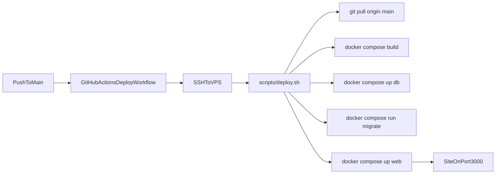

# 部署架构说明

这份文档用于解释当前项目从 `GitHub` 到 `VPS` 的自动化部署链路，以及各配置文件之间的关系。

## 1. 端到端流程

## 2. 四个核心文件各自做什么

- `.github/workflows/deploy.yml`
  - 触发时机：`push main` 或手动触发。
  - 行为：读取 `product` 环境 secrets，通过 SSH 登录 VPS，执行 `scripts/deploy.sh`。

- `scripts/deploy.sh`
  - 服务器部署入口脚本。
  - 顺序：拉代码 -> 构建 -> 启动 db -> 执行迁移 -> 启动 web。
  - 兼容 `docker compose` 和 `docker-compose` 两种命令形式。

- `docker-compose.yml`
  - `db`: PostgreSQL 常驻容器，带数据卷。
  - `web`: Next.js 运行容器（`Dockerfile` 的 `runner` 阶段）。
  - `migrate`: 一次性迁移容器（`Dockerfile` 的 `builder` 阶段，含 Prisma CLI）。

- `Dockerfile`
  - 多阶段构建：
    - `deps`: 安装依赖
    - `builder`: `prisma generate` + `next build`
    - `runner`: 仅运行产物，体积更小

## 3. 为什么要单独 `migrate` 服务

- `web` 用的是 `runner` 镜像，里面不包含完整开发工具链，通常没有 `prisma` CLI。
- 迁移需要 `prisma migrate deploy`，因此放到 `builder` 阶段对应的 `migrate` 服务执行最稳。
- 好处：避免 `prisma: not found`，并把“迁移”与“应用启动”职责拆开。

## 4. 必要 secrets（Environment: `product`）

- `VPS_HOST`: VPS 公网 IP 或域名
- `VPS_USER`: SSH 登录用户（建议 `deploy`）
- `VPS_SSH_KEY`: Actions 登录 VPS 的私钥全文
- `APP_DIR`: 项目在 VPS 上路径（例如 `/opt/personal-system`）

## 5. 发布时你最该看哪几步

1. GitHub Actions 日志是否成功执行到 SSH 步骤。
2. VPS 上 `git rev-parse --short HEAD` 是否等于远端最新 commit。
3. `docker compose ps` 里 `db` 是否 healthy、`web` 是否 up。
4. `/api/health` 是否返回 `status: ok`。

## 6. 常见问题速查

- `The ssh-private-key argument is empty`
  - Secret 名称不匹配，或 workflow 未绑定对应 `environment`。

- `prisma: not found`
  - 把迁移跑在 `web` 里导致。应使用 `migrate` 服务执行迁移。

- 页面没更新
  - 先确认 VPS 代码是否已更新，再强制重建 `web` 容器，最后排查浏览器缓存。
